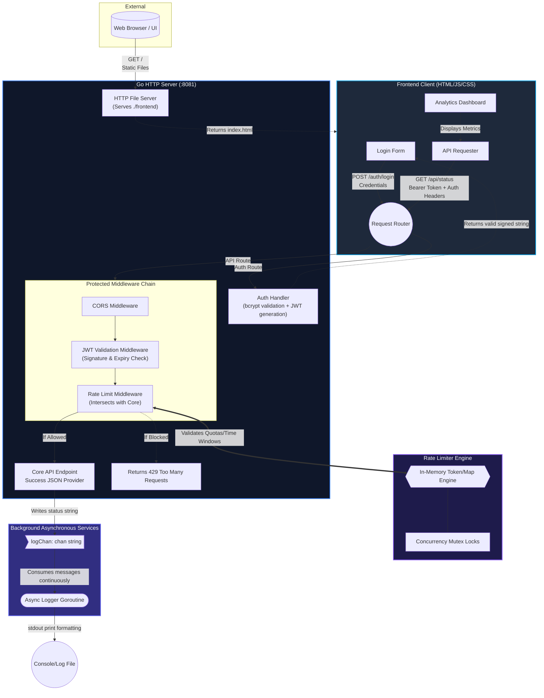

# SheildRate Full-Stack Architecture

This document outlines the architecture and data-flow of the newly upgraded Go-based Rate Limiter full-stack application.

## High-Level Architecture Diagram
The architecture is structured across three main layers: the static Client-Side Frontend, the HTTP Server Middleware Pipeline, and the Backend Core Logic comprising concurrency limits and asynchronous processes.

## Component Breakdown

1.  **Frontend Single Page Application (SPA)**:
    *   Served statically straight from Go (`http.FileServer`).
    *   Interacts directly with endpoints via JavaScript `fetch`.
    *   Manages connection tokens through browser `localStorage`.
2.  **Authentication & JWT Pipeline**:
    *   **Login**: The handler validates user passwords via `bcrypt` hashing mechanics.
    *   **Tokens**: Returns HS256 signed JWTs with personalized attributes (client IDs and expiration boundaries).
    *   **Interceptor Middleware**: Ensures any call hitting protected routes (`/api/...`) possesses a legitimate and verified token signature before anything else evaluates.
3.  **Rate Limiter Middleware & Concurrency Engine**:
    *   Extracts connected `X-Client-ID` identities.
    *   Passes identity requests deep into the thread-safe `RateLimiter` structure to tally consumption in predefined sliding or fixed windows. 
    *   Safe concurrent access to rate counts and data objects using Go `sync.Mutex` structures within [logic.go](file:///d:/GitHub/api-rate-limiter/rate-limiter/logic.go) preventing race conditions during immense application traffic.
4.  **Asynchronous Message Offloading (Goroutines/Channels)**:
    *   When the API handles a verified and allowed request, it pushes formatted logging metadata into `logChan := make(chan string, 100)`.
    *   The core request does *not* wait for logging I/O to complete, immediately closing and returning the JSON to the client.
    *   A detached background worker `go asyncLogger()` sequentially processes the backlogged events in memory to write them down securely.
